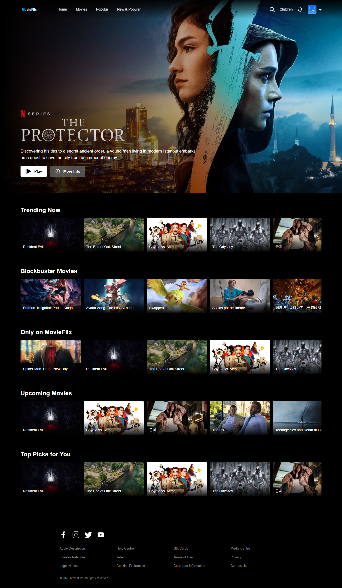
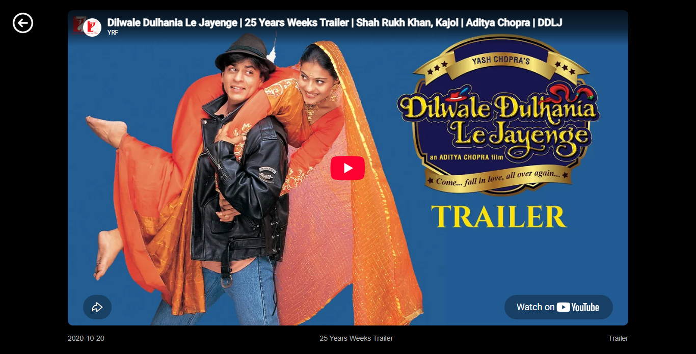

# 🎬 MovieFlix

A modern and responsive **movie streaming web application** built with **React.js, Vite, Firebase Authentication, and TMDB API**.

MovieFlix provides a movie-platform experience where users can browse movies and TV shows, search for content, explore movie details, watch trailers, and securely authenticate using Firebase.

---

## 🚀 Live Demo

🌐 **[View Live MovieFlix](https://movieflix-eight-olive.vercel.app/)**

📦 **[View Source Code](https://github.com/lokeshkumar72/movieflix)**

---

## 📸 Screenshots

### 🏠 Home Page



### 🔐 Sign In Page


### 📝 Sign Up Page


### ▶️ Player Page



## ✨ Features

- 🎬 Modern movie streaming platform UI
- 🏠 Dynamic home page
- 🔎 Movie and TV show browsing
- 🎞️ Dynamic movie categories
- 📄 Movie details
- ▶️ Watch movie trailers
- 🔐 Firebase Authentication
- 👤 User registration and login
- 🔑 Password reset
- 🔵 Google Authentication
- 🚪 Secure logout
- 💾 Firebase Firestore integration
- 🌐 TMDB API integration
- 🧭 React Router navigation
- 📱 Responsive design
- ⚡ Fast development with Vite
- 🎨 Modern and user-friendly interface
- 🔒 Environment variable support for API configuration

---

## 📸 Preview

> The application is deployed and available online.

🌐 **[Open MovieFlix](https://movieflix-eight-olive.vercel.app/)**

---

## 🛠️ Tech Stack

### Frontend

- **React.js**
- **JavaScript (ES6+)**
- **HTML5**
- **CSS3**
- **Vite**
- **React Router**

### Backend & Services

- **Firebase Authentication**
- **Firebase Firestore**
- **TMDB API**

### Development Tools

- **Git**
- **GitHub**
- **VS Code**
- **npm**
- **Vercel**

---

## 📂 Project Structure

`## 📂 Project Structure

```text
movieflix/
│
├── public/
│
├── screenshots/
│   ├── homepage.png
│   ├── login.png
│   ├── signup.png
│   └── player.png
│
├── favicon/
│   ├── apple-touch-icon.png
│   ├── favicon-96x96.png
│   ├── favicon.ico
│   ├── favicon.svg
│   ├── site.webmanifest
│   ├── web-app-manifest-192x192.png
│   └── web-app-manifest-512x512.png
│
├── src/
│   ├── assets/
│   │   └── cards/
│   │
│   ├── components/
│   │   ├── Navbar/
│   │   ├── TittleCards/
│   │   └── ...
│   │
│   ├── pages/
│   │   ├── Home/
│   │   ├── Login/
│   │   ├── Player/
│   │   └── ...
│   │
│   ├── firebase.js
│   ├── App.jsx
│   └── main.jsx
│
├── .gitignore
├── index.html
├── package.json
├── package-lock.json
├── vercel.json
├── vite.config.js
└── README.md
```

---

## ⚙️ Installation & Setup

Follow these steps to run MovieFlix locally.

### 1. Clone the repository

```bash
git clone https://github.com/lokeshkumar72/movieflix.git
```

### 2. Navigate to the project directory

```bash
cd movieflix
```

### 3. Install dependencies

```bash
npm install
```

### 4. Configure environment variables

Create a `.env` file in the root directory.

```env
VITE_TMDB_API_TOKEN=your_tmdb_api_token
```

Add the required Firebase configuration according to your Firebase project.

> ⚠️ **Important:** Never upload `.env` files, API keys, passwords, or private credentials to GitHub.

### 5. Start the development server

```bash
npm run dev
```

The application will be available at:

```text
http://localhost:5173
```

---

## 🔑 Environment Variables

MovieFlix uses environment variables to securely configure API access.

| Variable              | Description           |
| --------------------- | --------------------- |
| `VITE_TMDB_API_TOKEN` | TMDB API access token |

### `.gitignore`

Environment files are excluded from Git:

```text
.env
.env.local
.env.production
.env.development
```

This helps prevent API credentials from being accidentally committed to the repository.

---

## 🔥 Firebase Authentication

MovieFlix uses **Firebase Authentication** to manage user accounts and authentication.

### Authentication Features

- 👤 User Sign Up
- 🔐 User Login
- 🚪 User Logout
- 🔵 Google Sign-In
- 🔑 Password Reset
- 💾 Authentication Persistence
- 🔄 Authentication State Management

Firebase handles the authentication infrastructure without requiring a custom authentication server.

---

## 🗄️ Firebase Firestore

Firebase Firestore is used for application data management.

The project integrates Firestore with the frontend to store application-related user data.

---

## 🎞️ TMDB API

MovieFlix uses the **TMDB API** to retrieve movie and TV show information.

TMDB data is used for:

- 🎬 Movie titles
- 🖼️ Movie posters
- 🌄 Backdrop images
- 📝 Movie descriptions
- ⭐ Ratings
- 📅 Release information
- 🎥 Trailers
- 📺 TV shows and movie videos

---

## 🧭 Application Flow

```text
                         User
                           │
                           ▼
                       MovieFlix
                           │
             ┌─────────────┴─────────────┐
             │                           │
           Sign Up                     Login
             │                           │
             └─────────────┬─────────────┘
                           │
                           ▼
                 Firebase Authentication
                           │
                           ▼
                       Home Page
                           │
            ┌──────────────┼──────────────┐
            │              │              │
         Browse          Search        Categories
         Movies            │              │
            │              └──────┬───────┘
            │                     │
            ▼                     ▼
       Movie Cards          Movie Details
                                  │
                                  ▼
                              Trailers
                                  │
                                  ▼
                               TMDB API
```

---

## 💡 Key React Concepts Used

This project demonstrates practical usage of several React concepts:

- Functional Components
- React Hooks
- `useState`
- `useEffect`
- Props
- Component Reusability
- Conditional Rendering
- API Integration
- Asynchronous JavaScript
- React Router
- Authentication State Management
- Environment Variables
- Firebase Integration

---

## 🧠 Challenges & Solutions

### 🔹 Dynamic Movie Data

**Challenge:** Fetching and displaying constantly changing movie and TV show information.

**Solution:** Integrated the TMDB API and handled asynchronous API requests using React and JavaScript.

### 🔹 User Authentication

**Challenge:** Implementing registration, login, logout, password reset, and Google authentication.

**Solution:** Integrated Firebase Authentication to manage authentication and user sessions.

### 🔹 Responsive Interface

**Challenge:** Making the application usable across desktop, tablet, and mobile devices.

**Solution:** Implemented responsive CSS and flexible layouts.

### 🔹 API Error Handling

**Challenge:** Handling failed API requests and unavailable movie information.

**Solution:** Added error handling and fallback behavior when API requests fail.

### 🔹 Environment Security

**Challenge:** Preventing API credentials from being uploaded to GitHub.

**Solution:** Added `.env` files to `.gitignore` and configured API access through environment variables.

---

## 📱 Responsive Design

MovieFlix is designed to work across multiple screen sizes:

- 💻 Desktop
- 💻 Laptop
- 📱 Mobile
- 📲 Tablet

The UI adapts to different screen sizes to provide a consistent user experience.

---

## 🚀 Future Improvements

Planned improvements include:

- ❤️ Watchlist functionality
- ⭐ Personalized recommendations
- 👤 User profile page
- 🎥 Continue Watching
- 📜 Watch History
- 🔔 Notifications
- 🔍 Advanced movie filtering
- 🎬 Improved video player
- 📱 Progressive Web App (PWA)
- 🎯 Personalized content recommendations
- 🌙 Additional theme options

---

## 📊 Project Highlights

| Category       | Details                 |
| -------------- | ----------------------- |
| Project        | MovieFlix               |
| Frontend       | React.js                |
| Language       | JavaScript              |
| Build Tool     | Vite                    |
| Authentication | Firebase Authentication |
| Database       | Firebase Firestore      |
| Movie API      | TMDB API                |
| Routing        | React Router            |
| Styling        | CSS3                    |
| Deployment     | Vercel                  |
| Repository     | GitHub                  |
| Responsive     | Yes                     |

---

## 📚 Learning Outcomes

By building MovieFlix, I gained practical experience in:

- Building real-world React applications
- Creating reusable React components
- Consuming REST APIs
- Firebase Authentication
- Firebase Firestore
- React Router
- Responsive web development
- Environment variable management
- Git and GitHub workflows
- Vercel deployment
- API error handling
- Frontend debugging
- Managing application state

---

## 👨‍💻 Author

### Lokesh Kumar

**Frontend / Full Stack Developer**

I enjoy building modern, responsive web applications and learning new technologies by creating real-world projects.

### 🔗 Connect With Me

- 🐙 **GitHub:** [github.com/lokeshkumar72](https://github.com/lokeshkumar72)
- 💼 **LinkedIn:** [linkedin.com/in/lokesh-kumar-singh-](https://www.linkedin.com/in/lokesh-kumar-singh-/)

---

## ⭐ Show Your Support

If you like this project, please consider giving it a ⭐ on GitHub.

Your support is greatly appreciated!

---

## 📄 Disclaimer

MovieFlix is an independent project created **for educational and portfolio purposes only**.

This project is not affiliated with, sponsored by, or endorsed by Netflix.

Netflix is a registered trademark of Netflix, Inc.

Movie and TV show information is provided through the TMDB API.
